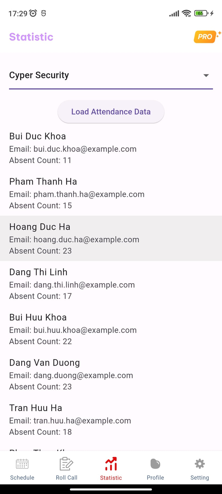

# Attendance Support - Backend
The attendance support allows lecturers to track schedules, create attendance
sessions, monitor statistics, and authenticate students through location and device
ID. I developed the messaging feature, enabling users to communicate in groups or
1-to-1. I"m using Flutter for app - a crossplatform can run on both Android and iOS.
# Technologies Used
Backend: Java Spring Boot, JPA, Spring Security (Authentication and Authorization via JWT)\
Real-Time Communication: WebSocket (Enables real-time, bidirectional communication between two users)

Database: MySQL
# Prerequisites
A MySQL server
Java SDK 21
# Start application
mvn spring-boot:run
# Step Instructions
1. Clone Repository\
  `git clone https://github.com/LilPooo/attendance-support-upgrade.git`\
   `cd attendance-support-upgrade`
   
2. Configure MySQL Database.\
   You need to create a database in MySQL to store the application data. Follow these steps:
   Step 1: Create a MySQL Database:\
   `CREATE DATABASE attendance_support_upgrade;`\
   Step 2: Configure Database Connection:\
   In the `src/main/resources/application.properties` file, set up the connection to your MySQL database:\
   `spring.datasource.url=jdbc:mysql://localhost:3306/attendance_support`\
   `spring.datasource.username=root  # Your MySQL username`\
   `spring.datasource.password=password  # Your MySQL password`
3. Build and Run The Project\
   `mvn spring-boot:run`
# Using Swagger to Test the API
Swagger UI is integrated into the project to help you interact with and test the API endpoints easily.\
1. Access Swagger UI\
   After starting the backend application, open your browser and navigate to:\
   http://localhost:8080/identity/swagger-ui/index.html
   
2. Test API Endpoint\
   Login admin:
   http://localhost:8080/identity/auth/token
   with "username": "admin", and "password" is also "admin". You will get a token, then you can use this token for other request.

# Using Postman to test the API
1. Download the Postman Collection:\
You can find the Postman collection file in the project repository under the src/main/resources/postman_collections/Attendance_Support_Upgrade.postman_collection.json.
2. Import the Collection into Postman
Open Postman.

- Click on the Import button (top-left of the window).

- Select Choose Files and navigate to the Attendance_Support_Upgrade.postman_collection.json file you downloaded.

- Click Open to import the collection into Postman.

3. Test the API

Once the collection is imported, you can start testing the available API endpoints.

For endpoints that require authentication, use the JWT token obtained from the `login API (POST /auth/token)` and add it to the Authorization tab in Postman as Bearer `<your-jwt-token>`.

# Mobile Application (Flutter UI) 
The **Attendance Support** project also includes a **mobile application** built with **Flutter**. The mobile app is designed to work seamlessly on both **Android** and **iOS** platforms.

### Key Features of the Mobile App:
- **Student Authentication**: Students can authenticate using their credentials, including a unique device ID and location-based authentication.
- **Attendance Tracking**: Lecturers can easily create attendance sessions and monitor student attendance.
- **Messaging**: The app enables real-time communication between lecturers and students through group chats or 1-to-1 messaging, utilizing WebSocket for real-time updates.
- **Real-Time Notifications**: Push notifications inform students of new sessions, messages, or any updates related to their attendance or schedules.
- **Cross-Platform**: The app is developed with Flutter, making it fully compatible with both **Android** and **iOS** devices.\
  Here’s a look at some screens of the app:\
  

    
    
    
    

# Notes
Ensure that both MySQL is running on your local system before starting the application.\
You may want to use a .env file or an external configuration management system for production environments instead of hardcoding sensitive information (like database credentials).

## Contact Information

If you have any questions or would like to know more about the **Attendance Support** project, feel free to contact me at:

- **Email**: [vuhoang4423@gmail.com](mailto:your-email@example.com)
- **GitHub**: [https://github.com/LilPooo](https://github.com/LilPooo)
- **LinkedIn**: [https://www.linkedin.com/in/hoang-trung-871226264/](https://www.linkedin.com/in/your-profile)

I’m happy to answer any questions or provide more details about the project!

   

